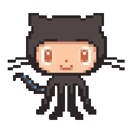

<!-- Static Name + Typing Role Animation -->

  

    <h1 style="font-size: 30px; margin: 0;">Hello, I'm Akshat</h1>
  

  <!-- Animated Typing Roles -->
  

<!-- Octocat + Connect Animation -->

  
   
  
    
  <!-- Portfolio Website Link -->
 
  <!-- LinkedIn Badge -->
  

<!-- Tech Stack -->

   
  <!-- Languages and Tools -->
  
  
  
  
  
  
  
  
  
  
  
  
  
  
   

<!-- GitHub Streak Stats -->

  

<!-- GitHub Snake Animation -->

  

## **Contribution Graph**

  

<!-- Footer -->

  

    
  

  

    &copy; 2025–present <a href="https://github.com/akshat2474" target="_blank">Akshat Singh</a>
  

  

    
  

